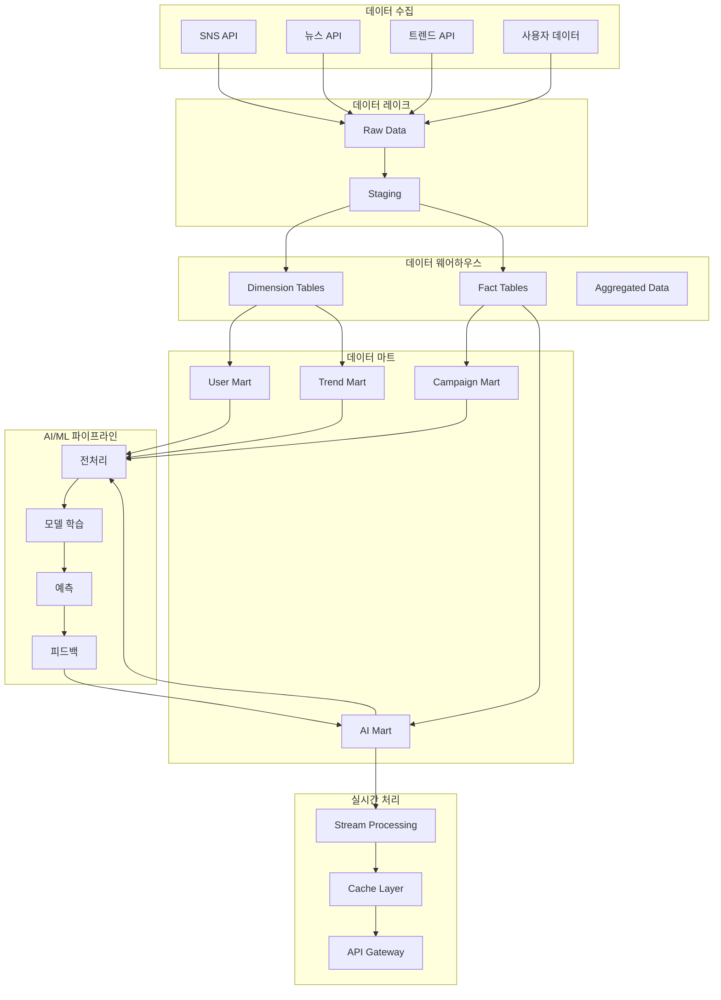

# 데이터/AI 파이프라인 설계

## 1. 전체 데이터 흐름 아키텍처



## 2. 데이터 수집 파이프라인

### 2.1 SNS 데이터 수집
- **Instagram, Facebook, Twitter, LinkedIn, TikTok 등 30개 플랫폼**
- **수집 데이터**: 포스트, 댓글, 좋아요, 공유, 해시태그, 사용자 정보
- **수집 주기**: 실시간 + 배치(일/주/월)
- **API 관리**: Rate Limiting, Error Handling, Retry Logic

### 2.2 뉴스/트렌드 데이터 수집
- **뉴스 API**: Google News, Naver News, 기타 뉴스 소스
- **트렌드 API**: Google Trends, Twitter Trends, TikTok Trends
- **키워드 추출**: NLP 기반 핵심 키워드 및 토픽 추출
- **감정 분석**: 긍정/부정/중립 감정 점수화

### 2.3 사용자 데이터 수집
- **행동 데이터**: 클릭, 스크롤, 체류시간, 페이지뷰
- **학습 데이터**: 미션 완료, 체크리스트, 진도율
- **피드백 데이터**: 평가, 리뷰, 만족도

## 3. 데이터 품질관리

### 3.1 데이터 검증
```python
# data/pipelines/quality_checks.py
class DataQualityChecker:
    def __init__(self):
        self.rules = {
            'completeness': 0.95,  # 95% 이상 완성도
            'accuracy': 0.90,       # 90% 이상 정확도
            'consistency': 0.85,    # 85% 이상 일관성
            'timeliness': 300       # 5분 이내 최신성
        }
    
    def validate_data(self, data, data_type):
        # 데이터 품질 검증 로직
        pass
    
    def generate_report(self):
        # 품질 보고서 생성
        pass
```

### 3.2 데이터 클리닝
- **중복 제거**: 동일 데이터 중복 제거
- **결측치 처리**: 평균값, 중앙값, 보간법 적용
- **이상치 탐지**: IQR, Z-score 기반 이상치 제거
- **정규화**: 데이터 스케일 통일

## 4. AI/ML 파이프라인

### 4.1 전처리 모듈
```python
# ai-engine/preprocessing/
class DataPreprocessor:
    def __init__(self):
        self.text_processor = TextProcessor()
        self.image_processor = ImageProcessor()
        self.numeric_processor = NumericProcessor()
    
    def preprocess_text(self, text_data):
        # 텍스트 전처리: 토큰화, 정규화, 불용어 제거
        pass
    
    def preprocess_image(self, image_data):
        # 이미지 전처리: 리사이즈, 정규화, 증강
        pass
    
    def preprocess_numeric(self, numeric_data):
        # 수치 데이터 전처리: 스케일링, 정규화
        pass
```

### 4.2 모델 학습 파이프라인
```python
# ai-engine/training/
class ModelTrainer:
    def __init__(self):
        self.models = {
            'trend_prediction': TrendPredictionModel(),
            'sentiment_analysis': SentimentAnalysisModel(),
            'content_recommendation': ContentRecommendationModel(),
            'campaign_optimization': CampaignOptimizationModel()
        }
    
    def train_model(self, model_name, training_data):
        # 모델 학습 및 검증
        pass
    
    def evaluate_model(self, model_name, test_data):
        # 모델 성능 평가
        pass
    
    def save_model(self, model_name, model):
        # 모델 저장 및 버전 관리
        pass
```

### 4.3 예측/추론 파이프라인
```python
# ai-engine/prediction/
class PredictionEngine:
    def __init__(self):
        self.loaded_models = {}
        self.cache = RedisCache()
    
    def predict_trends(self, input_data):
        # 트렌드 예측
        pass
    
    def analyze_sentiment(self, text):
        # 감정 분석
        pass
    
    def recommend_content(self, user_profile):
        # 콘텐츠 추천
        pass
    
    def optimize_campaign(self, campaign_data):
        # 캠페인 최적화
        pass
```

## 5. 실시간 처리 시스템

### 5.1 Stream Processing
```python
# backend/stream_processor.py
import asyncio
from fastapi import FastAPI
from aioredis import Redis

class StreamProcessor:
    def __init__(self):
        self.redis = Redis()
        self.app = FastAPI()
    
    async def process_real_time_data(self, data):
        # 실시간 데이터 처리
        processed_data = await self.preprocess(data)
        predictions = await self.predict(processed_data)
        await self.update_cache(predictions)
        return predictions
    
    async def broadcast_updates(self, updates):
        # WebSocket을 통한 실시간 업데이트 브로드캐스트
        pass
```

### 5.2 Cache Layer
```python
# backend/cache_manager.py
class CacheManager:
    def __init__(self):
        self.redis = Redis()
        self.cache_ttl = 3600  # 1시간
    
    async def cache_trends(self, trends_data):
        # 트렌드 데이터 캐싱
        pass
    
    async def cache_user_recommendations(self, user_id, recommendations):
        # 사용자별 추천 캐싱
        pass
    
    async def get_cached_data(self, key):
        # 캐시된 데이터 조회
        pass
```

## 6. 데이터 파이프라인 자동화

### 6.1 ETL 스케줄링
```yaml
# .github/workflows/data-pipeline.yml
name: Data Pipeline
on:
  schedule:
    - cron: '0 */6 * * *'  # 6시간마다
  workflow_dispatch:

jobs:
  collect-data:
    runs-on: ubuntu-latest
    steps:
      - uses: actions/checkout@v3
      - name: Collect SNS Data
        run: python data/pipelines/collect_sns_data.py
      - name: Collect News Data
        run: python data/pipelines/collect_news_data.py
      - name: Collect Trends Data
        run: python data/pipelines/collect_trends_data.py
  
  process-data:
    needs: collect-data
    runs-on: ubuntu-latest
    steps:
      - name: Data Quality Check
        run: python data/pipelines/quality_checks.py
      - name: Data Preprocessing
        run: python data/pipelines/preprocess_data.py
      - name: Load to Warehouse
        run: python data/pipelines/load_to_warehouse.py
  
  train-models:
    needs: process-data
    runs-on: ubuntu-latest
    steps:
      - name: Train AI Models
        run: python ai-engine/train_models.py
      - name: Deploy Models
        run: python ai-engine/deploy_models.py
```

### 6.2 모니터링 및 알림
```python
# data/pipelines/monitoring.py
class PipelineMonitor:
    def __init__(self):
        self.metrics = {
            'data_quality_score': 0,
            'processing_time': 0,
            'error_rate': 0,
            'model_accuracy': 0
        }
    
    def monitor_pipeline(self):
        # 파이프라인 모니터링
        pass
    
    def send_alert(self, alert_type, message):
        # 알림 발송
        pass
    
    def generate_report(self):
        # 모니터링 리포트 생성
        pass
```

## 7. 데이터 거버넌스

### 7.1 데이터 카탈로그
- **메타데이터 관리**: 데이터 소스, 스키마, 품질 지표
- **데이터 라인지**: 데이터 흐름 추적 및 감사
- **접근 제어**: 역할 기반 데이터 접근 권한 관리

### 7.2 데이터 보안
- **암호화**: 저장 및 전송 시 데이터 암호화
- **마스킹**: 민감 정보 마스킹 처리
- **백업**: 정기적인 데이터 백업 및 복구

## 8. 성능 최적화

### 8.1 쿼리 최적화
- **인덱싱**: 자주 조회되는 컬럼 인덱스 생성
- **파티셔닝**: 대용량 테이블 파티셔닝
- **캐싱**: Redis를 통한 쿼리 결과 캐싱

### 8.2 스케일링
- **수평 확장**: 여러 서버에 부하 분산
- **수직 확장**: 서버 리소스 증설
- **자동 스케일링**: 부하에 따른 자동 확장/축소

이 설계를 기반으로 실제 구현을 진행하겠습니다. 